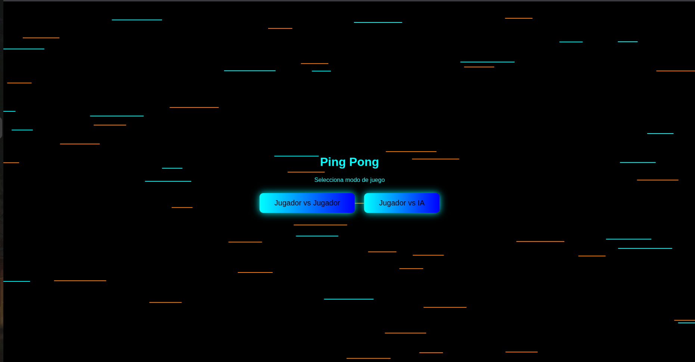
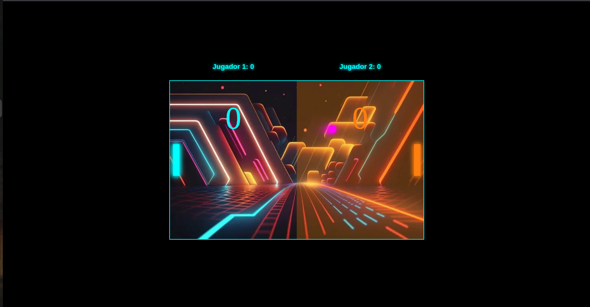

🎮 Ping Pong

Fecha: Octubre 2025

**Descripción del Juego**

Ping Pong es una versión estilizada del clásico juego Pong, ambientado en un entorno con efectos visuales neón. El juego ofrece dos modos de juego: Jugador vs Jugador y Jugador vs IA. Los jugadores controlan paletas verticales que se mueven arriba y abajo para golpear una pelota que rebota por la pantalla. El objetivo es hacer que la pelota pase la paleta del oponente para anotar puntos. El primer jugador en alcanzar 4 puntos gana la partida.

El juego presenta una estética futurista con colores neón (cian y naranja), efectos de brillo, animaciones de fondo dinámicas y una interfaz. Los controles son simples e intuitivos: el Jugador 1 usa las teclas W y S, mientras que el Jugador 2 (en modo multijugador) usa las flechas arriba y abajo.

**Bocetos**

###  Pantalla 1: Portada (Menú Principal)

*Descripción:* La pantalla de portada presenta el título del juego "Ping Pong Futurista" con un fondo animado de líneas horizontales en movimiento en colores cian y naranja. Los jugadores pueden seleccionar entre dos modos de juego mediante botones estilizados con efectos de brillo neón.

### Pantalla 2: Juego en Acción

*Descripción:* Durante el juego, se muestra el campo de batalla con ambas paletas (cian para Jugador 1, naranja para Jugador 2), la pelota en movimiento con efecto de brillo magenta, y el marcador gigante en la parte superior.

**Controles**

Jugador 1 (Izquierda - Cian):
- W - Mover paleta hacia arriba
- S - Mover paleta hacia abajo

Jugador 2 (Derecha - Naranja):
- Flecha Arriba ↑ - Mover paleta hacia arriba
- Flecha Abajo ↓ - Mover paleta hacia abajo

**Reglas del Juego**

1. Cada jugador controla una paleta en su lado de la pantalla
2. La pelota rebota en las paredes superior e inferior
3. Los jugadores deben golpear la pelota con su paleta para evitar que pase
4. Si la pelota pasa la paleta de un jugador, el oponente anota 1 punto
5. El primer jugador en alcanzar 4 puntos gana la partida
6. La velocidad de la pelota aumenta ligeramente con cada rebote
7. Después de cada punto, hay una pausa de 1 segundo antes de que la pelota se reinicie

**Tecnologías Esperadas**

- HTML5 Canvas - Para renderizar los gráficos del juego
- JavaScript - Lógica del juego y animaciones
- CSS - Estilos y efectos visuales

