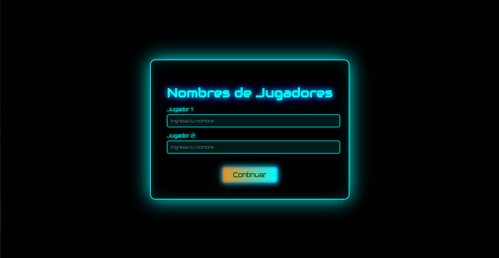
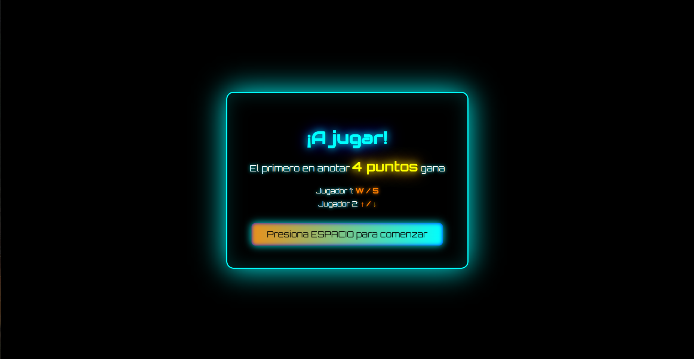
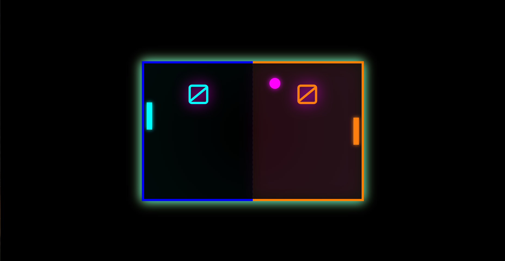
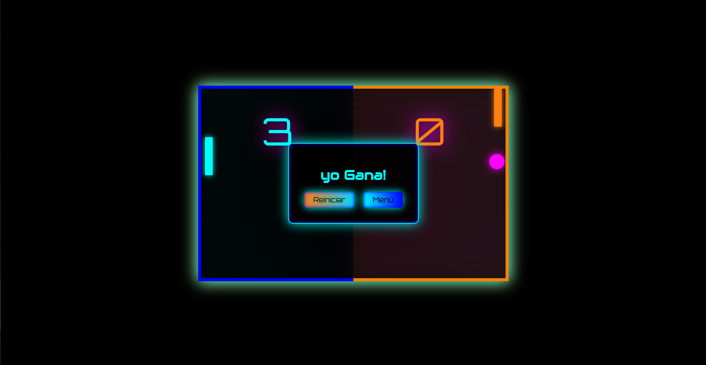
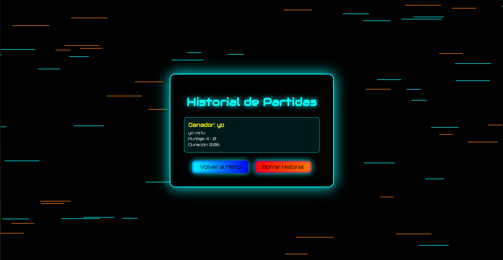

# 🏓 Ping Pong


## 📋 Descripción del Proyecto

Este Ping Pong es una reimaginación moderna del clásico juego Pong, con una estética cyberpunk y efectos visuales neón vibrantes. El proyecto combina la simplicidad del juego original con una presentación visual contemporánea, ofreciendo dos modos de juego completos y un sistema de seguimiento de estadísticas.

### Características principales

- **Dos modos de juego:** Enfrenta a un amigo localmente o desafía a una IA inteligente
- **Estética neón futurista:** Efectos de brillo, gradientes dinámicos y animaciones fluidas
- **Sistema de nombres personalizados:** Los jugadores pueden ingresar sus nombres antes de cada partida
- **Historial de partidas:** Guarda automáticamente los resultados con detalles completos
- **Animaciones de fondo:** Líneas horizontales en movimiento que crean profundidad visual
- **Efectos de sonido:** Audio inmersivo para rebotes, puntos y victorias
- **Música ambiente:** Banda sonora de fondo durante el juego

## 🎮 Modos de Juego

### 1 Jugador (vs Bot)
El jugador controla la paleta izquierda mientras enfrenta a un oponente controlado por computadora. La IA cuenta con:
- Sistema de predicción de trayectoria de la pelota
- Errores calculados para mayor realismo
- Velocidad adaptativa según la dirección de la pelota
- Momentos de distracción aleatorios

### 2 Jugadores (Local)
Dos jugadores comparten el mismo teclado en un duelo cara a cara. Cada jugador controla su propia paleta con controles independientes.

## 🕹️ Controles

**Jugador 1 (Paleta Izquierda - Cian):**
- `W` - Mover hacia arriba
- `S` - Mover hacia abajo

**Jugador 2 (Paleta Derecha - Naranja):**
- `↑` (Flecha Arriba) - Mover hacia arriba
- `↓` (Flecha Abajo) - Mover hacia abajo

**Controles generales:**
- `ESPACIO` - Iniciar la partida desde la pantalla de instrucciones

## 📖 Reglas del Juego

1. Cada jugador controla una paleta vertical en su lado de la pantalla
2. La pelota rebota en las paredes superior e inferior del campo
3. Los jugadores deben golpear la pelota con su paleta para devolverla al oponente
4. Si la pelota pasa la paleta de un jugador, el oponente anota **1 punto**
5. El primer jugador en alcanzar **4 puntos** gana la partida
6. La velocidad de la pelota aumenta progresivamente:
   - 3% de incremento con cada rebote en las paredes
   - 5% de incremento al golpear una paleta
7. El ángulo de rebote varía según dónde golpee la pelota en la paleta
8. Después de cada punto, hay una pausa de 0.9 segundos antes del siguiente saque

## 🎨 Pantallas del Juego

### Pantalla 1: Menú Principal


- Título principal con efectos de brillo animados
- Tres botones de navegación estilizados
- Fondo animado con líneas horizontales en movimiento
- Colores: Cian (#0ff) y Naranja (#ff7f0f)

### Pantalla 2: Ingreso de Nombres



- Campos de texto personalizados con efectos neón
- Validación automática (máximo 15 caracteres)
- Adaptación según el modo seleccionado (oculta el segundo campo en modo IA)

### Pantalla 3: Instrucciones Pre-Juego



- Recordatorio de las reglas principales
- Controles detallados para cada jugador
- Botón de inicio con animación pulsante

### Pantalla 4: Campo de Juego



- Campo dividido visualmente (mitad izquierda/derecha)
- Marcador gigante centrado en la parte superior
- Paletas con efectos de sombra y brillo
- Pelota con rastro luminoso magenta
- Línea divisoria punteada en el centro

### Pantalla 5: Game Over



- Ventana emergente con el nombre del ganador
- Opciones para reiniciar o volver al menú
- Reproducción de sonido de victoria

### Pantalla 6: Historial de Partidas



- Lista completa de partidas guardadas
- Información detallada: ganador, perdedor, puntaje final y duración
- Opción para borrar todo el historial
- Mantiene las últimas 50 partidas

## 🛠️ Tecnologías Utilizadas

- **HTML5 Canvas** - Renderizado de gráficos del juego en tiempo real
- **JavaScript ES6** - Lógica del juego, física de colisiones y sistema de IA
- **CSS3** - Estilos avanzados, animaciones y efectos visuales
- **LocalStorage API** - Persistencia de datos del historial de partidas
- **Web Audio API** - Reproducción de efectos de sonido y música

## 📂 Estructura del Proyecto

```
ping-pong/
│
├── index.html          # Estructura HTML principal
├── css/
│   └── style.css       # Estilos y animaciones
├── js/
│   └── script.js       # Lógica del juego
├── img/
│   ├── hit.mp3         # Sonido de rebote
│   ├── point.mp3       # Sonido de punto anotado
│   ├── vic.mp3         # Sonido de victoria
│   └── End of Line.mp3 # Música de fondo
└── screenshots/
    ├── menu-principal.png
    ├── ingreso-nombres.png
    ├── instrucciones.png
    ├── juego-accion.png
    ├── game-over.png
    └── historial.png
```

## 🎯 Detalles Técnicos

### Sistema de Física
- Detección de colisiones pixel-perfect
- Rebotes calculados con ángulos variables
- Aceleración progresiva de la pelota
- Límites de velocidad para mantener jugabilidad

### Sistema de IA(Bot)
- Tiempo de reacción: 50ms
- Margen de error: ±12 píxeles
- Probabilidad de error de predicción: 12%
- Probabilidad de distracción momentánea: 3%
- Velocidades adaptativas según contexto del juego

### Sistema de Guardado
- Almacenamiento local en el navegador
- Registro automático al finalizar cada partida
- Datos guardados:  nombres, puntajes, duración
- Límite de 50 partidas en historial

## 🚀 Cómo Ejecutar

1. Descarga todos los archivos del proyecto
2. Asegúrate de mantener la estructura de carpetas correcta
3. Abre el archivo `index.html` en un navegador web moderno
4. Disfruta del juego (se recomienda Chrome, Firefox o Edge)

## 📱 Responsive Design

El juego incluye media queries para pantallas pequeñas:
- Ajuste automático del canvas en dispositivos móviles
- Reducción de tamaños de fuente en pantallas menores a 820px
- Reorganización de elementos para mejor visualización
